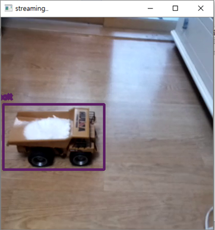
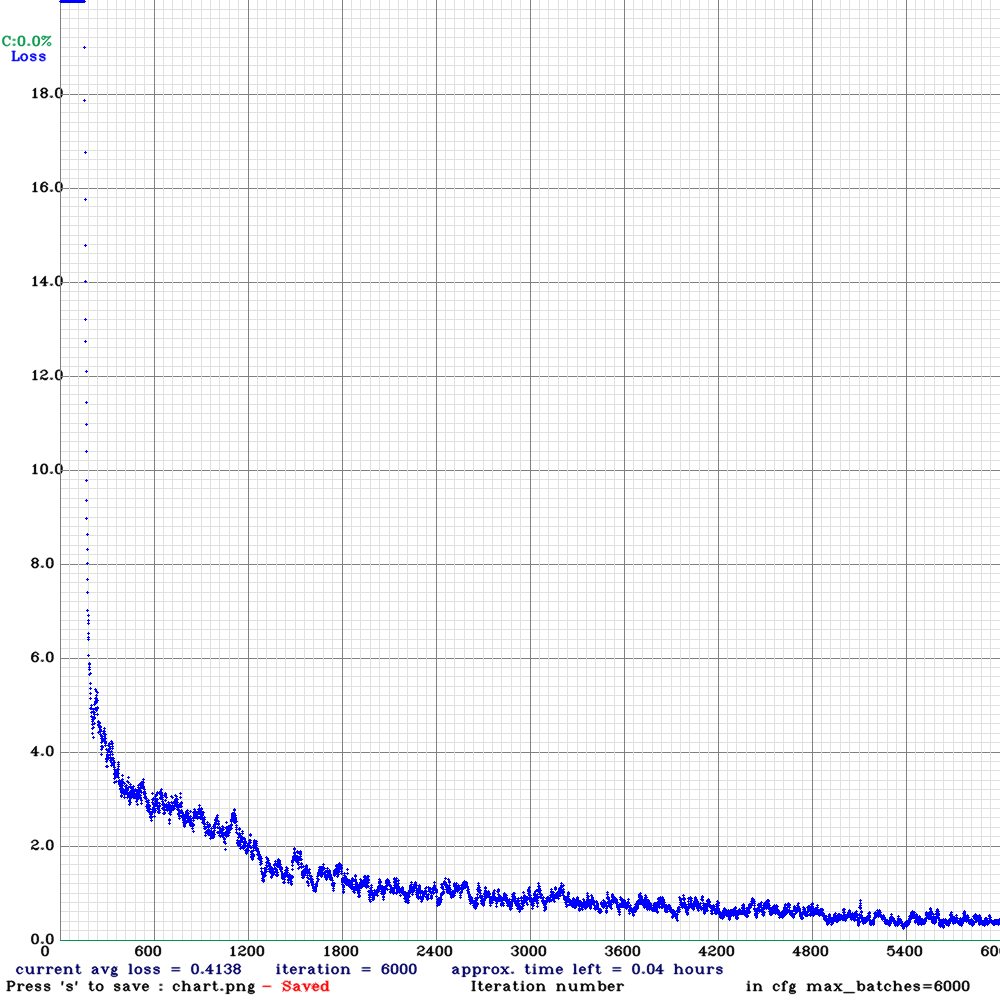

# Yolov4-object-detection

> 라즈베리파이, Yolo + OpenCV를 이용한 적재량 탐지 및 알람

### Requirements

**pip**

* opencv-python
* numpy

**etc**

* [salt.weight](https://drive.google.com/file/d/18DHg_NI_WY64ESIeLW-1isnSbH8IOjs-/view?usp=sharing) <- Download here
* raspberrypi + cam for UDP Streaming

**For training**

* [Darknet](https://github.com/AlexeyAB/darknet)

* [Yolomark](https://github.com/AlexeyAB/Yolo_mark)

-----

### Loss Graph

